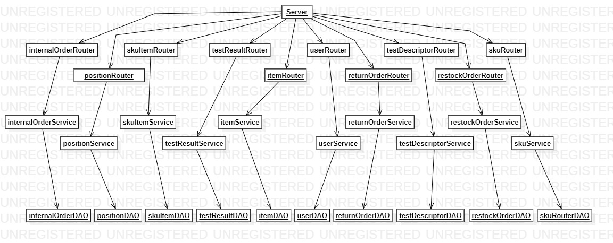

# Integration and API Test Report

Date:

Version:

# Contents

- [Dependency graph](#Dependency)

- [Integration approach](#integration)

- [Tests](#tests)

- [Scenarios](#scenarios)

- [Coverage of scenarios and FR](#scenario-coverage)
- [Coverage of non-functional requirements](#nfr-coverage)

# Dependency graph 

     <report the here the dependency graph of the classes in EzWH, using plantuml or other tool>

     
# Integration approach

    <Write here the integration sequence you adopted, in general terms (top down, bottom up, mixed) and as sequence
    (ex: step1: class A, step 2: class A+B, step 3: class A+B+C, etc)> 
    <Some steps may  correspond to unit testing (ex step1 in ex above), presented in other document UnitTestReport.md>
    <One step will  correspond to API testing>
    
### BOTTOM-UP

Step 1: Unit Test of DAOs classes \
Step 2: test of the Service classes \
Step 3: API class tested

#  Integration Tests

   <define below a table for each integration step. For each integration step report the group of classes under test, and the names of
     Jest test cases applied to them, and the mock ups used, if any> Jest test cases should be here code/server/unit_test

## Step 1
| Classes  | mock up used |Jest test cases |
|--|--|--|
| internalOrderDAO |  | all test in internalOrderDAO.test.js |
| itemDAO | | all test in itemDAO.test.js |
|positionDAO||all test in positionDAO.test.js|
|testDescriptorDAO|| all test in testDescriptorDAO.test.js|
|restockOrderDAO|| all test in restockOrderDAO.test.js|
|returnOrderDAO|| all test in returnOrderDAO.test.js|
|SKUDAO||all test in SKUDAO.test.js|
|SKUItemDAO||all test in SKUItemDAO.test.js|
|testResultDAO||all test in testResultDAO.test.js|
|userDAO||all test in userDAO.test.js|

## Step 2
| Classes  | mock up used |Jest test cases |
|--|--|--|
| internalOrderService | mockInternalOrderDAO | all test in internalOrderServiceDBMock.test.js |
| itemService | mockItemDAO | all test in itemServiceDBMock.test.js |
|positionService| mockPositionDAO |all test in positionServiceDBMock.test.js|
|testDescriptorService|mockTestDescriptorDAO | all test in testDescriptorServiceDBMock.test.js|
|restockOrderService| mockRestockOrderDAO | all test in restockOrderServiceDBMock.test.js|
|returnOrderService| mockReturnOrderDAO  | all test in returnOrderServiceDBMock.test.js|
|SKUService| mockSKUDAO |all test in SKUServiceDBMock.test.js|
|SKUItemService| mockSKUItemDAO |all test in SKUItemServiceDBMock.test.js|
|testResultService| mockTestResultDAO |all test in testResultServiceDBMock.test.js|
|userService| mockUserDAO |all test in userServiceDBMock.test.js|

## Step 3

   
| Classes  | mock up used |Jest test cases |
|--|--|--|
|server, itemRouter||all test in testItemRouter.js|
|server, internalOrderRouter||all test in testInternalOrderRouter.js|
|server, positionRouter||all test in testPositionRouter.js|
|server, restockOrderRouter||all test in testRestockOrderRouter.js|
|server, returnOrderRouter||all test in returnOrderRouter.js|
|server, SKUItemRouter||all test in testSKUItemRouter.js|
|server, SKURouter||all test in testSKURouter.js|
|server, testDescriptorRouter||all test in testTestDescriptorRouter.js|
|server, testResultRouter||all test in testTestResultRouter.js|
|server, userRouter||all test in testUserRouter.js|

# API testing - Scenarios

<If needed, define here additional scenarios for the application. Scenarios should be named
 referring the UC in the OfficialRequirements that they detail>

## Scenario UCx.y

| Scenario |  name |
| ------------- |:-------------:| 
|  Precondition     |  |
|  Post condition     |   |
| Step#        | Description  |
|  1     |  ... |  
|  2     |  ... |

# Coverage of Scenarios and FR

<Report in the following table the coverage of  scenarios (from official requirements and from above) vs FR. 
Report also for each of the scenarios the (one or more) API Mocha tests that cover it. >  Mocha test cases should be here code/server/test

| Scenario ID | Functional Requirements covered | Mocha  Test(s) | 
| ----------- | ------------------------------- | ----------- | 
|1-1|2.1| createSKU()|
|1-2|2.1|modifySKU()|
|1-3|2.1|modifySKU()|
|2-1|3.1.1|createPosition()|
|2-2|3.1.1|modifyPosition()|
|2-3|3.1.1|modifyPosition()|
|2-4|3.1.1|modifyPosition()|
|2-5|3.1.2|deletePosition()|
|3-2|5.1 5.2 5.3 5.5 5.6|createRestockOrder() addSkuItemList() changeStateRestockOrder()|
|4-1|1.1|createUser()|
|4-2|1.1|modifyUser()|
|4-3|1.2|deleteUser()|
|6-1| 5.9 5.10|getReturnOrderById() getSKUItem() addItemRestockOrder()|
|6-2| 5.9 5.10|getReturnOrderById() getSKUItem() addItemRestockOrder()|
|9-1|6.1 6.2 6.5 6.6 6.10|createInternalOrder() addSkuInternalOrder() modifyIntenralOrder() changeSKU()|
|9-2|6.1 6.2 6.5 6.6 6.10|createInternalOrder() addSkuInternalOrder() modifyIntenralOrder() changeSKU()|
|9-3|6.6|modifyInternalOrder() deleteInternalOrder() changeSKU()|
|10-1|6.6 6.8 6.9|getInternalOrderById() modifyInternalOrder()|
|11-1|7|createItem()|
|11-2|7|modifyItem()|
|12-1||createTestDescriptor()|
|12-2||modifyTestDescriptor()|
|12-3||deleteTestDescriptor()|

# Coverage of Non Functional Requirements

<Report in the following table the coverage of the Non Functional Requirements of the application - only those that can be tested with automated testing frameworks.>

### 

| Non Functional Requirement | Test name |
| -------------------------- | --------- |
|        4                    |       createPosition()    |
|5|createSKU()|
|6|createSKUItem()|

