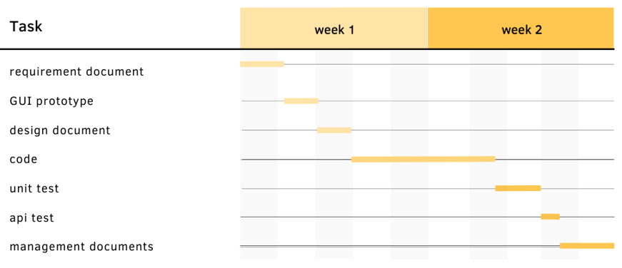

# Project Estimation  
Date:

Version:

# Estimation approach
Consider the EZWH  project as described in YOUR requirement document, assume that you are going to develop the project INDEPENDENT of the deadlines of the course
# Estimate by size
### 
|             | Estimate                        |             
| ----------- | ------------------------------- |  
| NC =  Estimated number of classes to be developed   |  20                           |             
|  A = Estimated average size per class, in LOC       | 150                           | 
| S = Estimated size of project, in LOC (= NC * A) | 3000 |
| E = Estimated effort, in person hours (here use productivity 10 LOC per person hour)  | 300                                     |   
| C = Estimated cost, in euro (here use 1 person hour cost = 30 euro) | 9000 | 
| Estimated calendar time, in calendar weeks (Assume team of 4 people, 8 hours per day, 5 days per week ) |   2                 |               

# Estimate by product decomposition
### 
|         component name    | Estimated effort (person hours)   |             
| ----------- | ------------------------------- | 
|requirement document    | 50 |
| GUI prototype | 30 |
|design document | 30 |
|code | 160 |
| unit tests | 40 |
| api tests | 10 |
| management documents  | 20 |

# Estimate by activity decomposition
### 
|         Activity name    | Estimated effort (person hours)   |             
| ----------- | ------------------------------- | 
| Implements Users and Privileges | 40 |
| Implements Products | 40 |
| Manage Orders | 50 |
| Manage physical space | 20 |
| Manage Notifications | 20 | 
###

# Summary

Report here the results of the three estimation approaches. The  estimates may differ. Discuss here the possible reasons for the difference

|             | Estimated effort                        |   Estimated duration |          
| ----------- | ------------------------------- | ---------------|
| estimate by size | 300 | 80
| estimate by product decomposition | 340 | 220
| estimate by activity decomposition | 170 | 110

