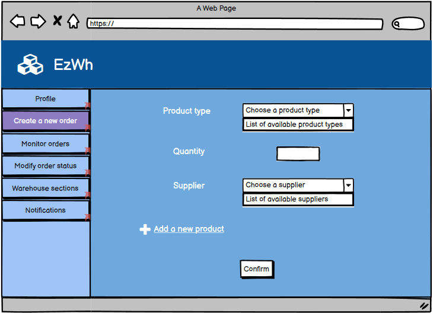
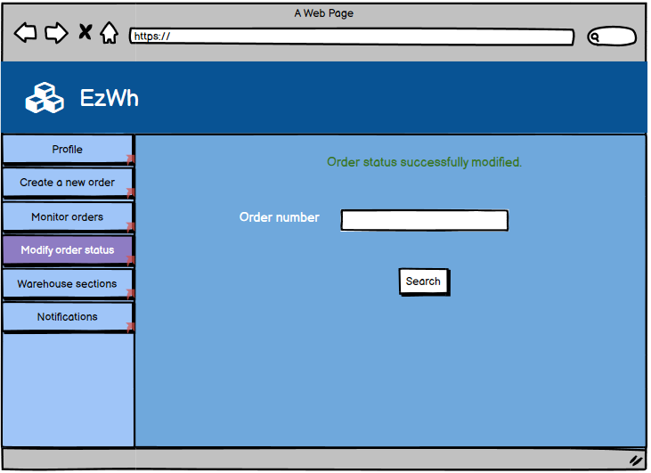
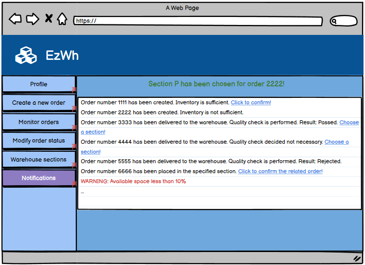
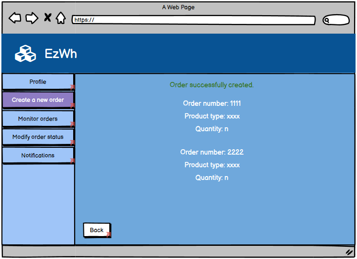
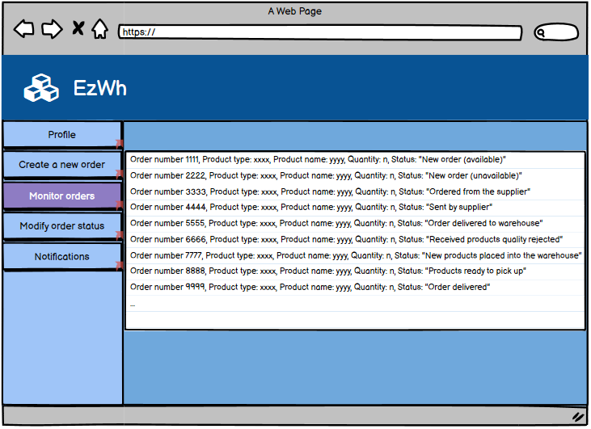
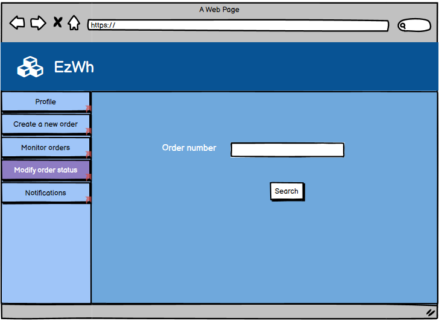

# Graphical User Interface Prototype  

Authors:

Date:

Version:

\<Report here the GUI that you propose. You are free to organize it as you prefer. A suggested presentation matches the Use cases and scenarios defined in the Requirement document. The GUI can be shown as a sequence of graphical files (jpg, png)  >

Home:

Home-Incorrect Username or Password:

Administrator-Profile:

Administrator-Create a new user:

Administrator-Create a new user-User already exists:

Administrator-Create a new user-Password does not match:

Administrator-Create a new user-User created successfully:

Administrator-Modify a user:

Administrator-Modify a user-User does not exist:

Administrator-Modify a user-User exists:

Administrator-Modify a user-Modify password:

Administrator-Modify a user-Modify password-Password does not match:

Administrator-Modify a user-User successfully deleted:

Administrator-Modify a user-User successfully modified:

Administrator-Add a product:

Administrator-Add a product-Product code already exists:

Administrator-Add a product-Product successfully added:

Administrator-Modify a product:

Administrator-Modify a product-Product does not exist:

Administrator-Modify a product-Product exists:

Administrator-Modify a product-Available suppliers:

Administrator-Modify a product-Modify a supplier:

Administrator-Modify a product-Add a new supplier:

Administrator-Modify a product-Product successfully modified:

Administrator-Modify a product-Product successfully deleted:

Administrator-Monitor Warehouse sections:

Administrator-Monitor Warehouse sections-Selected section:

Administrator-Monitor Warehouse sections-Modify:

Administrator-Monitor orders:

Administrator-Notifications:

Manager-Profile:

Manager-Create a new external order:

Manager-Create a new external order-Order successfully created:

Manager-Monitor orders:

Manager-Modify order status:

Manager-Modify order status(Order does not exist):

Manager-Modify order status(Order exists):

Manager-Modify order status(Order status modified):

Manager-Monitor Warehouse sections:

Manager-Monitor Warehouse sections(Selected section):

Manager-Monitor Warehouse sections(Modify):

Manager-Notifications:

Manager-Notifications-Confirm order:

Manager-Notifications-Choose section:

Manager-Notifications-Section confirmed:

OU-Profile:

OU-Create a new order:

OU-Create a new order-Order successfully created:

OU-Monitor orders:

OU-Modify order status:

OU-Modify order status(Order does not exist):

OU-Modify order status(Order exists):

OU-Modify order status(Order status modified):

OU-Notifications:

Supplier-Profile:

Supplier-Monitor orders:

Supplier-Modify order status:

Supplier-Modify order status(Order does not exist):

Supplier-Modify order status(Order exists):

Supplier-Modify order status(Order status modified):

Supplier-Notifications:

Quality office-Profile:

Quality office-Monitor orders:

Quality office-Modify order status:

Quality office-Modify order status(Order does not exist):

Quality office-Modify order status(Order exists):

Quality office-Modify order status(Order status modified):

Delivery unit-Profile:

Delivery unit-Monitor orders:

Delivery unit-Modify order status:

Delivery unit-Modify order status(Order does not exist):

Delivery unit-Modify order status(Order exists):

Delivery unit-Modify order status(Order status modified):

Delivery unit-Search product:

Delivery unit-Search product-Product does not exist:

Delivery unit-Search product-Product exists:

Delivery unit-Notifications:

