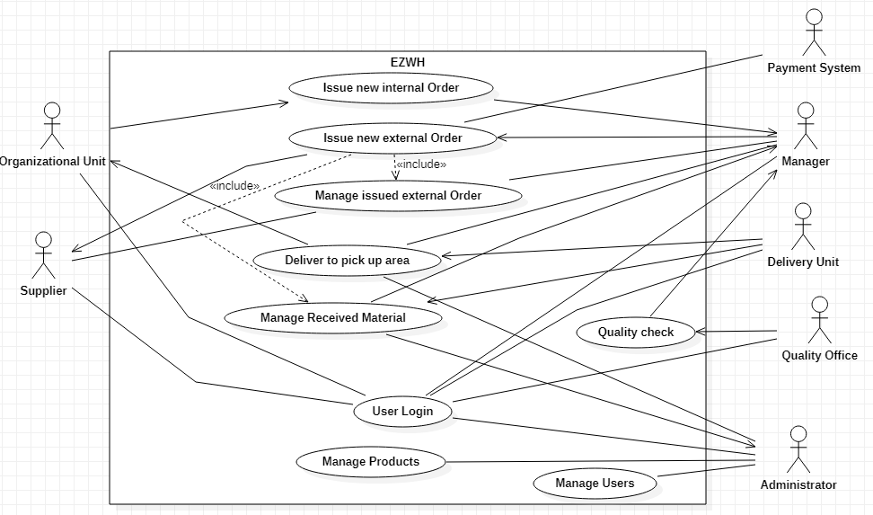

 #Requirements Document 

Date: 22 march 2022

Version: 0.0

| Version number | Change |
| ----------------- |:-----------|
| | |

# Contents

- [Informal description](#informal-description)
- [Stakeholders](#stakeholders)
- [Context Diagram and interfaces](#context-diagram-and-interfaces)
	+ [Context Diagram](#context-diagram)
	+ [Interfaces](#interfaces) 
	
- [Contents](#contents)
- [Informal description](#informal-description)
- [Stakeholders](#stakeholders)
- [Context Diagram and interfaces](#context-diagram-and-interfaces)
	- [Context Diagram](#context-diagram)
		- [Actors](#actors)
	- [Interfaces](#interfaces)
- [Stories and personas](#stories-and-personas)
- [Functional and non functional requirements](#functional-and-non-functional-requirements)
	- [Functional Requirements](#functional-requirements)
	- [Access right, actor vs function](#access-right-actor-vs-function)
	- [Non Functional Requirements](#non-functional-requirements)
- [Use case diagram and use cases](#use-case-diagram-and-use-cases)
	- [Use case diagram](#use-case-diagram)
		- [Use case 1, UC1 - User Login](#use-case-1-uc1---user-login)
		- [Use case 2, UC2 - Manage Users](#use-case-2-uc2---manage-users)
				- [Scenario 2.1](#scenario-21)
				- [Scenario 2.2](#scenario-22)
				- [Scenario 2.3](#scenario-23)
		- [Use case 3, UC3 - Manage Products](#use-case-3-uc3---manage-products)
				- [Scenario 3.1](#scenario-31)
				- [Scenario 3.2](#scenario-32)
				- [Scenario 3.3](#scenario-33)
		- [Use case 4, UC4 - Issue New Internal Order](#use-case-4-uc4---issue-new-internal-order)
				- [Scenario 4.1](#scenario-41)
				- [Scenario 4.2](#scenario-42)
		- [Use case 5, UC5 - Issue New External Order](#use-case-5-uc5---issue-new-external-order)
				- [Scenario 5.1](#scenario-51)
		- [Use case 6, UC6 - Manage Issued External Order](#use-case-6-uc6---manage-issued-external-order)
				- [Scenario 6.1](#scenario-61)
		- [Use case 7, UC7 - Quality check](#use-case-7-uc7---quality-check)
				- [Scenario 7.1](#scenario-71)
				- [Scenario 7.2](#scenario-72)
				- [Scenario 7.3](#scenario-73)
		- [Use case 8, UC8 - Manage Received Materials](#use-case-8-uc8---manage-received-materials)
				- [Scenario 8.1](#scenario-81)
		- [Use case 9, UC9 - Deliver Products to Pickup Areas](#use-case-9-uc9---deliver-products-to-pickup-areas)
				- [Scenario 9.1](#scenario-91)
				- [Scenario 9.2](#scenario-92)
		- [Use case 10, UC10 - Pick Up Products](#use-case-10-uc10---pick-up-products)
				- [Scenario 10.1](#scenario-101)
- [Glossary](#glossary)
- [Deployment Diagram](#deployment-diagram)

# Informal description

Medium companies and retailers need a simple application to manage the relationship with suppliers and the inventory of physical items stocked in a physical warehouse.
The warehouse is supervised by a manager, who supervises the availability of items. When a certain item is in short supply, the manager issues an order to a supplier. In general the same item can be purchased by many suppliers. The warehouse keeps a list of possible suppliers per item. 

After some time the items ordered to a supplier are received. The items must be quality checked and stored in specific positions in the warehouse. The quality check is performed by specific roles (quality office), who apply specific tests for item (different items are tested differently). Possibly the tests are not made at all, or made randomly on some of the items received. If an item does not pass a quality test it may be rejected and sent back to the supplier.

Storage of items in the warehouse must take into account the availability of physical space in the warehouse. Further the position of items must be traced to guide later recollection of them.

The warehouse is part of a company. Other organizational units (OU) of the company may ask for items in the warehouse. This is implemented via internal orders, received by the warehouse. Upon reception of an internal order the warehouse must collect the requested item(s), prepare them and deliver them to a pick up area. When the item is collected by the other OU the internal order is completed.

EZWH (EaSy WareHouse) is a software application to support the management of a warehouse.

# Stakeholders

| Stakeholder name  | Description |
| ----------------- |:-----------:|
|   Company     |     Uses the application        |
|   Supplier     |       Provides products      |
|   Manager     |      Manages warehouse       |
|   Application administrator     |      Installs the application, maintains it, defines users, assign privileges and define product types     |
|   Quality office     |      Performs quality check on the products       |
|    Competitor   |      Provides the same kind of service      |
|   Organizational unit   |      Orders and receives products       |
|   Delivery unit     |      Places items in the warehouse, collects, prepares and delivers them to pick up areas      |
|   Payment system     |      Handles payments       |

# Context Diagram and interfaces

## Context Diagram

### Actors

Manager  
Application administrator  
Quality office  
Organizational unit  
Delivery unit  
Supplier  
Payment system  

## Interfaces

| Actor | Logical Interface | Physical Interface  |
| ------------- |:-------------:| -----:|
|   Supplier     | GUI | Mouse, keyboard on PC |
|   Manager     | GUI | Mouse, keyboard on PC |
|   Application administrator     | GUI + command line interface | Mouse, keyboard on PC  |
|   Quality office     | GUI | Mouse, keyboard on PC |
|   Organizational unit     | GUI | Mouse, keyboard on PC |
| Delivery Unit | GUI | Mouse, Keyboard on PC |
|   Payment system     | API, see https://developer.visa.com/docs | Internet Connection |

# Stories and personas

Persona1: Male, middle age, works as the manager of the warehouse, does not have enough experience yet, really busy and might forget some trivial tasks.

Persona2: Female, experienced, disciplined, works as the head of one of the organizational units, need to follow the state of each order to be able to plan for the unit.

Persona3: Male, young, works as a worker in the delivery unit, carries a lot of products during the day to and from the warehouse, needs to find the products as soon as possible.

# Functional and non functional requirements

## Functional Requirements

| ID        | Description  |
| ------------- |:-------------:|
|  FR1     | Manage users and privileges |
|  FR1.1     | Create a new user  |
|  FR1.2     | Modify an existing user  |
|  FR1.3     | Delete a user |
|  FR2     | Manage products |
|  FR2.1     | Search a product and show its details |
|  FR2.2     | Add a new product to the inventory |
|  FR2.3     | Modify a product (suppliers, location, etc.) |
|  FR2.4     | Delete a specific product from the database |
|  FR3     | Manage orders |
|  FR3.1     | Update the status of both internal and external orders |
|  FR3.2     | Manage internal orders |
|  FR3.2.1    | Issue new internal orders |
|  FR3.2.2     | Manage deliveries to the pickup area |
|  FR3.3     | Manage external orders |
|  FR3.3.1     | Issue new external orders to suppliers |
|  FR3.3.2     | Display the list of available suppliers |
|  FR3.3.3     | Handle payments for external orders |
|  FR3.3.4     | Deal with the items received from suppliers according to the result of the quality check |
|  FR4     | Manage physical space |
|  FR4.1     | Monitor the amount of available space |
|  FR4.2     | Indicate free sections |
|  FR5     | Manage notifications |
|  FR5.1     | Manage user specified notifications |
|  FR5.2     | Notify manager when the total available space is below the specified minimum threshold |

## Access right, actor vs function

| Function | Manager | Adminstrator | Quality office | Organizational units| Delivery unit | Suppliers |
| ----- |:-----:| :-----:| :-----:|:-----:|:-----:|:-----|
| FR1 | No | Yes | No | No | No | No |
| FR2.1 | Yes | Yes | No | Yes | Yes | No |
| FR2.2 | No | Yes | No | No | No | No |
| FR2.3 | No | Yes | No | No | No | No |
| FR2.4 | No | Yes | No | No | No | No |
| FR3.1 | Yes | Yes | Only at specific stages | Only at specific stages | Only at specific stages | Only at specific stages |
| FR3.2.1 | No | No | No | Yes | No | No |
| FR3.2.3 | Yes | No | No | No | Yes | No |
| FR3.3.1 | Yes | No | No | No | No | No |
| FR3.3.4 | Yes | No | Yes | No | Yes | No |
| FR4 | Yes | No | No | No | Yes | No |
| FR5 | Yes | Yes | Yes | No | Yes | Yes |

## Non Functional Requirements

| ID        | Type (efficiency, reliability, ..)           | Description  | Refers to |
| ------------- |:-------------:| :-----:| -----:|
|  NFR1     | Usability  | Users should be able to use the application without any education | All FR|
|  NFR2     | Performance | All functions should complete in less than 0.5 second |All FR|
|  NFR3     | Privacy | Suppliers cannot access company internal data |All FR|
| NFR4 | Correctness | Must guarantee not more than one error per month | All FR |
| NFR5 | Reliability | Must guarantee not more than one defects at month | All FR |

# Use case diagram and use cases

## Use case diagram

### Use case 1, UC1 - User Login

| Actors Involved        | All actors |
| ------------- |:-------------:|
|  Precondition     | User not authenticated |
|  Post condition     | User authenticated and logged in |
|  Nominal Scenario     | User enters username and password |
|  Exceptions    | Username or password is invalid |

### Use case 2, UC2 - Manage Users

| Actors Involved        | Administrator |
| ------------- |:-------------:|
|  Precondition     | Administrator logged in |
|  Post condition     | User account created or modified |
|  Nominal Scenario     | The administrator creates a new account and populates its fields |
|  Variants     | Modification of fields and access rights of a user |
|  Variants     | Deletion of an account |
|  Exceptions    | Creation of an account that arleady exists |
|  Exceptions    | Deletion of his/her own account |

##### Scenario 2.1 

| Scenario 2.1 | The adminsitrator creates a new user |
| ------------- |:-------------:|
|  Precondition     | User account doesn't exist |
|  Post condition     | User account exists |
| Step#        |   |
|  1     | Adimistrator enters the user information |
|  2     | Adimistrator defines access permissions and role in the company  |
|  3     | Administrator confirms the creation |

##### Scenario 2.2

| Scenario 2.2 | The administrator modifies a user account |
| ------------- |:-------------:|
|  Precondition     | User account exists |
|  Post condition     | User account modified |
| Step#        |  Description |
|  1     | Administrator searches and selects the username to be modified |
|  2     | Administrator modifies information and/or access premission of the user   |
| 3 | Administrator confirms the modification |

##### Scenario 2.3

| Scenario 2.3 | The administrator deletes a user account |
| ------------- |:-------------:|
|  Precondition     | User account exists |
|  Post condition     | User account does not exist |
| Step#        |  Description |
|  1     | Administrator searches and selects the username to be deleted |
|  2     | Administrator confirms the deletion |

### Use case 3, UC3 - Manage Products

| Actors Involved        | Administrator |
| ------------- |:-------------:|
|  Precondition     | Administrator logged in |
|  Post condition     | Product added or modified |
|  Nominal Scenario     | The administrator adds a new product and specifies its information |
|  Variants     | Modification of a product details |
|  Variants     | Deletion of a product |
|  Exceptions    | Creation of a product that arleady exists |
|  Exceptions    | Deletion of a product that its quantity in the warehouse is not zero |

##### Scenario 3.1 

| Scenario 3.1 | The adminsitrator adds a new product |
| ------------- |:-------------:|
|  Precondition     | Product doesn't exist |
|  Post condition     | Product information registered |
| Step#        |   |
|  1     | Adimistrator enters the product information |
|  2     | Administrator confirms the creation |

##### Scenario 3.2

| Scenario 3.2 | The administrator modifies a product details|
| ------------- |:-------------:|
|  Precondition     | Product information exist |
|  Post condition     | Product information modified |
| Step#        |  Description |
|  1     | Administrator searches and selects the product to be modified |
|  2     | Administrator modifies the details of the product   |
| 3 | Administrator confirms the modification |

##### Scenario 3.3

| Scenario 3.3 | The administrator deletes a product |
| ------------- |:-------------:|
|  Precondition     | Product information exist |
|  Post condition     | Product information do not exist |
| Step#        |  Description |
|  1     | Administrator searches and selects the product to be deleted |
|  2     | Administrator confirms the deletion |

### Use case 4, UC4 - Issue New Internal Order

| Actors Involved        | Organizational unit, Manager |
| ------------- |:-------------:|
|  Precondition     | Organizational unit logged in |
|  Precondition     | Product already added |
|  Post condition     | A new order created |
|  Post condition     | Manager is notified of the creation of a new order |
|  Nominal Scenario     | Organizational unit issues a new order and the inventory is sufficient |
|  Variants     | The inventory is not sufficient for the order |

##### Scenario 4.1

| Scenario 4.1 | The inventory is sufficient |
| ------------- |:-------------:|
|  Precondition     | Organizational unit logged in |
|  Post condition     | A new order created with status "New order (available)" |
|  Post condition     | Manager is notified of the creation of a new order |
| Step#        |  Description |
|  1     | Organizational unit searches and selects the products required and their quantities |
|  2     | Organizational Unit confirms the order |

##### Scenario 4.2

| Scenario 4.2 | The inventory is not sufficient |
| ------------- |:-------------:|
|  Precondition     | Organizational unit logged in |
|  Post condition     | A new order created with status "New order (unavailable)" |
|  Post condition     | Manager is notified of the creation of a new order |
| Step#        |  Description |
|  1     | Organizational unit searches and selects the products required and their quantities |
|  2     | Organizational Unit confirms the order |

### Use case 5, UC5 - Issue New External Order

| Actors Involved        | Manager, Supplier, Payment system |
| ------------- |:-------------:|
|  Precondition     | Manager logged in |
|  Post condition     | Supplier is notified of the order |
|  Nominal Scenario     | Manager issues a new external order |

##### Scenario 5.1

| Scenario 5.1 | Issue a new external order |
| ------------- |:-------------:|
|  Precondition     | A new order created with status "New order (unavailable)" |
|  Post condition     | Order status updated to "Ordered from the supplier" |
|  Post condition     | Supplier is notified of the order |
| Step#        |  Description |
|  1     | Manager selects a supplier from the list of the product suppliers |
| 2 | Manager determines the quantity |
|  3     | Manager confirms the order |
|  4     | Handle the payment |

### Use case 6, UC6 - Manage Issued External Order

| Actors Involved        | Supplier|
| ------------- |:-------------:|
|  Precondition     | An order exists with status "Ordered from the supplier" |
|  Precondition     | Supplier is notified of the order |
|  Post condition     | Products are sent to the warehouse |
|  Post condition     | Order status updated to "Sent by supplier" |
|  Nominal Scenario     | Supplier updates the order status |

##### Scenario 6.1

| Scenario 6.1 | Supplier process the order |
| ------------- |:-------------:|
|  Precondition     | Supplier logged in |
|  Post condition     | Order status updated to "Sent by supplier" |
| Step#        |  Description |
|  1     | Supplier receives the order |
| 2 | Suppier sends the products |
| 3 | Supplier updates the order status |

### Use case 7, UC7 - Quality check

| Actors Involved        | Manager, Quality office |
| ------------- |:-------------:|
|  Precondition     | An order exists with status "Sent by the supplier" |
|  Precondition     | The products received |
|  Post condition     | Order status updated |
|  Nominal Scenario     | Quality office confirms the products |
|Variants| Quality office does not perform quality check |
|Variants | Quality office rejects the products |

##### Scenario 7.1

| Scenario 7.1 | Products quality confirmed |
| ------------- |:-------------:|
|  Precondition     | Quality check passed |
|  Post condition     | Order status updated to "Order delivered to warehouse" |
| Step#        |  Description |
|  1     | Quality office performs quality check on the products |
|  2     | Order status is updated |
| 3 | Manager is notified of the new products |

##### Scenario 7.2

| Scenario 7.2 | Products quality not checked |
| ------------- |:-------------:|
|  Precondition     | Quality check decided not necessary |
|  Post condition     | Order status updated to "Order delivered to warehouse" |
| Step#        |  Description |
|  1     | Quality office performs quality check on the products |
|  2     | Order status is updated |
| 3 | Manager is notified of the new products |

##### Scenario 7.3

| Scenario 7.3 | Products quality rejected |
| ------------- |:-------------:|
|  Precondition     | Quality check not passed |
|  Post condition     | Order status updated to "Received products quality rejected" |
| Step#        |  Description |
|  1     | Quality office performs quality check on the products |
|  2     | Order status is updated |
| 3 | Manager is notified of the test result |
| 4 | Manager rejects the products |

### Use case 8, UC8 - Manage Received Materials

| Actors Involved        | Manager, Administrator, Delivery unit |
| ------------- |:-------------:|
|  Precondition     | Order status updated to "Order delivered to warehouse" |
|  Precondition     | Manager is notified of the new products |
|  Post condition     | Products placed in the specified sections |
|  Post condition     | Order status updated |
|  Post condition     | Product details updated |
|  Post condition     | Physical space status updated |
|  Nominal Scenario     | Place received materials |

##### Scenario 8.1

| Scenario 8.1 | Place received materials |
| ------------- |:-------------:|
|  Precondition     | Products not included in the warehouse |
|  Post condition     | Products included in the warehouse and the information updated |
| Step#        |  Description |
|  1     | Manager searches for free sections to place the new products |
|  1     | Manager selects a section |
| 2 | Notify the delivery unit to transfer the products to warehouse |
| 3| Notify the administrator to update product details and physical space status |
| 4| Notify manager in case of low available space|
|  5    | Order status updated to "New products placed into the warehouse" |
|  6    | Notify the manager that the new products have been placed |

### Use case 9, UC9 - Deliver Products to Pickup Areas

| Actors Involved        | Manager, Administrator, Delivery unit, Organizational unit |
| ------------- |:-------------:|
|  Precondition     | Organizational unit issued a new order |
|  Precondition     | Order available in the warehouse |
|  Post condition     | Order delivered to pickup area |
|  Post condition     | Order status updated |
|  Post condition     | Product details updated |
|  Post condition     | Physical space status updated |
|  Nominal Scenario     | No external order was needed |
|Variants| External order was needed |

##### Scenario 9.1

| Scenario 9.1 | No external order was needed |
| ------------- |:-------------:|
|  Precondition     | An order exists with status "New order (available)" |
|  Post condition     | Products ready to pick up |
| Step#        |  Description |
|  1     | Manager confirms the order |
| 2 | Notify the delivery unit to transfer the products to pickup area |
| 3| Notify the administrator to update product details and physical space status |
|  4    | Delivery unit searches for the product to see where it is |
|  5    | Delivery unit places the product in the pick up area |
|  6    | Order status updated to "Products ready to pick up" |
| 7| Notify organizational unit |

##### Scenario 9.2

| Scenario 9.2 | External order was needed |
| ------------- |:-------------:|
|  Precondition     | An order exists with status "New products placed into the warehouse" |
|  Post condition     | Products ready to pick up |
| Step#        |  Description |
|  1     | Manager confirms the order |
| 2 | Notify the delivery unit to transfer the products to pickup area |
| 3| Notify the administrator to update product details and physical space status |
|  4    | Delivery unit searches for the product to see where it is |
|  5    | Delivery unit places the product in the pick up area |
|  6   | Order status updated to "Products ready to pick up" |
| 7| Notify organizational unit |

### Use case 10, UC10 - Pick Up Products
| Actors Involved        | Organizational unit |
| ------------- |:-------------:|
|  Precondition     | An order exists with status "Products ready to pickup" |
|  Post condition     | Order status upsated to "Order delivered" |
|  Nominal Scenario     | Organizational unit collects the items |

##### Scenario 10.1

| Scenario 10.1 |  Organizational unit collects the items |
| ------------- |:-------------:|
|  Precondition     | Products ready to pick up |
|  Precondition     | Organizational unit notified of the placed products |
|  Post condition     | Order status updated to "Order delivered" |
| Step#        |  Description |
|  1     | The products are delivered to the organizational unit |
| 2 | Order status updated |

# Glossary

# Deployment Diagram 

