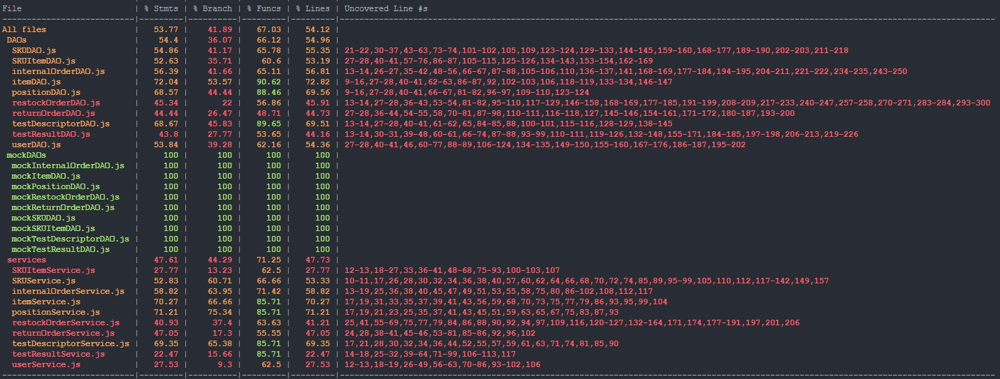

# Unit Testing Report

Date:

Version:

# Contents

- [Black Box Unit Tests](#black-box-unit-tests)

- [White Box Unit Tests](#white-box-unit-tests)

# Black Box Unit Tests

    <Define here criteria, predicates and the combination of predicates for each function of each class.
    Define test cases to cover all equivalence classes and boundary conditions.
    In the table, report the description of the black box test case and (traceability) the correspondence with the Jest test case writing the 
    class and method name that contains the test case>
    <Jest tests  must be in code/server/unit_test  >

 ### **Class *SKU* - method *getAllItems***

**Criteria for method *getAllSkus*:**
	

 - there are skus in the database

**Predicates for method *getAllSkus*:**

| Criteria | Predicate |
| -------- | --------- |
| there are skus in the databse         |        YES   |
|          |      NO     |

**Boundaries**:

| Criteria | Boundary values |
| -------- | --------------- |
|          |                 |

**Combination of predicates**:

| There are skus in the database | Valid / Invalid | Description of the test case | Jest test case |
|-------|-------|-------|-------|
| Yes | Valid|T1() -> true| getAllSkus()|
| No | Invalid| T2() -> false| "|

 ### **Class *SKU* - method *addSku***

**Criteria for method *addSku*:**
	

 - Validity of the Sku to be inserted

**Predicates for method *addSku*:**

| Criteria | Predicate |
| -------- | --------- |
| Validity of the Sku to be inserted       |        YES   |
|          |      NO     |

**Boundaries**:

| Criteria | Boundary values |
| -------- | --------------- |
|          |                 |

**Combination of predicates**:

| Validity of the Sku to be inserted | Valid / Invalid | Description of the test case | Jest test case |
|-------|-------|-------|-------|
| Yes | Valid|T1(validSku) -> true| addSku(validSku)|
| No | Invalid| T2(invalidSku) -> false| "|

 ### **Class *SKU* - method *modifySku***

**Criteria for method *modifySku*:**
	

 - the Sku with given id is in the database
 - the new fields are valid

**Predicates for method *modifySku*:**

| Criteria | Predicate |
| -------- | --------- |
|    Sku with given id is in the database      |        YES   |
|          |      NO     |
| new fields are valid | YES|
||NO|

**Boundaries**:

| Criteria | Boundary values |
| -------- | --------------- |
|          |                 |

**Combination of predicates**:

| the Sku with given id is in the database | The new fields are valid| Valid / Invalid | Description of the test case | Jest test case |
|-------|-------|-------|-------|-|
| Yes | Yes| Valid|T1(validId validFields) -> true| modifySku(validId, validFilelds)|
| Yes | No | Invalid | T2(validId invalidFields) -> false| "|
| No | Yes | Invalid | T2(invalidId, validFields) -> false| "|
| No | No | Invalid | T2(invalidId, invalidFields) -> false| "|

 ### **Class *SKU* - method *deleteSku***

**Criteria for method *deleteSku*:**
	

 - Sku with given id is in the database

**Predicates for method *deleteSku*:**

| Criteria | Predicate |
| -------- | --------- |
| Sku with given id is in the database      |        YES   |
|          |      NO     |

**Boundaries**:

| Criteria | Boundary values |
| -------- | --------------- |
|          |                 |

**Combination of predicates**:

| Sku with given id is in the database | Valid / Invalid | Description of the test case | Jest test case |
|-------|-------|-------|-------|
| Yes | Valid|T1(validId) -> true| deleteSku()|
| No | Invalid| T2(invalidId) -> false| "|

 ### **Class *SKU* - method *getAllSkus***

**Criteria for method *getAllSkus*:**
	

 - there are skus in the database

**Predicates for method *getAllSkus*:**

| Criteria | Predicate |
| -------- | --------- |
| there are skus in the databse         |        YES   |
|          |      NO     |

**Boundaries**:

| Criteria | Boundary values |
| -------- | --------------- |
|          |                 |

**Combination of predicates**:

| There are skus in the database | Valid / Invalid | Description of the test case | Jest test case |
|-------|-------|-------|-------|
| Yes | Valid|T1() -> true| getAllSkus()|
| No | Invalid| T2() -> false| "|

### **Class *SKU ITEM* - method *getAllSkuItems***

**Criteria for method *getAllSkuItems*:**
	

 - there are skuItems in the database

**Predicates for method *getAllSkuItems*:**

| Criteria | Predicate |
| -------- | --------- |
| there are skuItems in the databse         |        YES   |
|          |      NO     |

**Boundaries**:

| Criteria | Boundary values |
| -------- | --------------- |
|          |                 |

**Combination of predicates**:

| There are skuItems in the database | Valid / Invalid | Description of the test case | Jest test case |
|-------|-------|-------|-------|
| Yes | Valid|T1() -> true| getAllSkuItems()|
| No | Invalid| T2() -> false| "|

 ### **Class *SKU ITEM* - method *addSkuItem***

**Criteria for method *addSkuItem*:**
	

 - Validity of the SkuItem to be inserted

**Predicates for method *addSkuItem*:**

| Criteria | Predicate |
| -------- | --------- |
| Validity of the SkuItem to be inserted       |        YES   |
|          |      NO     |

**Boundaries**:

| Criteria | Boundary values |
| -------- | --------------- |
|          |                 |

**Combination of predicates**:

| Validity of the SkuItem to be inserted | Valid / Invalid | Description of the test case | Jest test case |
|-------|-------|-------|-------|
| Yes | Valid|T1(validSkuItem) -> true| addSkuItem(validSkuItem)|
| No | Invalid| T2(invalidSkuItem) -> false| "|

 ### **Class *SKU ITEM* - method *modifySkuItem***

**Criteria for method *modifySkuItem*:**
	

 - the SkuItem with given id is in the database
 - the new fields are valid

**Predicates for method *modifySkuItem*:**

| Criteria | Predicate |
| -------- | --------- |
|    SkuItem with given id is in the database      |        YES   |
|          |      NO     |
| new fields are valid | YES|
||NO|

**Boundaries**:

| Criteria | Boundary values |
| -------- | --------------- |
|          |                 |

**Combination of predicates**:

| the SkuItem with given id is in the database | The new fields are valid| Valid / Invalid | Description of the test case | Jest test case |
|-------|-------|-------|-------|-|
| Yes | Yes| Valid|T1(validId validFields) -> true| modifySkuItem(validId, validFilelds)|
| Yes | No | Invalid | T2(validId invalidFields) -> false| "|
| No | Yes | Invalid | T2(invalidId, validFields) -> false| "|
| No | No | Invalid | T2(invalidId, invalidFields) -> false| "|

 ### **Class *SKU ITEM* - method *deleteSkuItem***

**Criteria for method *deleteSkuItem*:**
	

 - SkuItem with given id is in the database

**Predicates for method *deleteSkuItem*:**

| Criteria | Predicate |
| -------- | --------- |
| SkuItem with given id is in the database      |        YES   |
|          |      NO     |

**Boundaries**:

| Criteria | Boundary values |
| -------- | --------------- |
|          |                 |

**Combination of predicates**:

| SkuItem with given id is in the database | Valid / Invalid | Description of the test case | Jest test case |
|-------|-------|-------|-------|
| Yes | Valid|T1(validId) -> true| deleteSkuItem()|
| No | Invalid| T2(invalidId) -> false| "|

### **Class *POSITION* - method *getAllPositions***

**Criteria for method *getAllPositions*:**
	

 - there are positions in the database

**Predicates for method *getAllPositions*:**

| Criteria | Predicate |
| -------- | --------- |
| there are positions in the databse         |        YES   |
|          |      NO     |

**Boundaries**:

| Criteria | Boundary values |
| -------- | --------------- |
|          |                 |

**Combination of predicates**:

| There are positions in the database | Valid / Invalid | Description of the test case | Jest test case |
|-------|-------|-------|-------|
| Yes | Valid|T1() -> true| getAllPositions()|
| No | Invalid| T2() -> false| "|

 ### **Class *POSITION* - method *addPosition***

**Criteria for method *addPosition*:**
	

 - Validity of the position to be inserted

**Predicates for method *addPosition*:**

| Criteria | Predicate |
| -------- | --------- |
| Validity of the position to be inserted       |        YES   |
|          |      NO     |

**Boundaries**:

| Criteria | Boundary values |
| -------- | --------------- |
|          |                 |

**Combination of predicates**:

| Validity of the position to be inserted | Valid / Invalid | Description of the test case | Jest test case |
|-------|-------|-------|-------|
| Yes | Valid|T1(validPosition) -> true| addPosition(validPosition)|
| No | Invalid| T2(invalidPosition) -> false| "|

 ### **Class *POSITION* - method *modifyPosition***

**Criteria for method *modifyPosition*:**
	

 - the position with given id is in the database
 - the new fields are valid

**Predicates for method *modifyPosition*:**

| Criteria | Predicate |
| -------- | --------- |
|    position with given id is in the database      |        YES   |
|          |      NO     |
| new fields are valid | YES|
||NO|

**Boundaries**:

| Criteria | Boundary values |
| -------- | --------------- |
|          |                 |

**Combination of predicates**:

| the position with given id is in the database | The new fields are valid| Valid / Invalid | Description of the test case | Jest test case |
|-------|-------|-------|-------|-|
| Yes | Yes| Valid|T1(validId validFields) -> true| modifyPosition(validId, validFilelds)|
| Yes | No | Invalid | T2(validId invalidFields) -> false| "|
| No | Yes | Invalid | T2(invalidId, validFields) -> false| "|
| No | No | Invalid | T2(invalidId, invalidFields) -> false| "|

 ### **Class *POSITION* - method *deletePosition***

**Criteria for method *deletePosition*:**
	

 - position with given id is in the database

**Predicates for method *deletePosition*:**

| Criteria | Predicate |
| -------- | --------- |
| position with given id is in the database      |        YES   |
|          |      NO     |

**Boundaries**:

| Criteria | Boundary values |
| -------- | --------------- |
|          |                 |

**Combination of predicates**:

| position with given id is in the database | Valid / Invalid | Description of the test case | Jest test case |
|-------|-------|-------|-------|
| Yes | Valid|T1(validId) -> true| deletePosition()|
| No | Invalid| T2(invalidId) -> false| "|

### **Class *TEST DESCRIPTOR* - method *getAllTestDescriptors***

**Criteria for method *getAllTestDescriptors*:**
	

 - there are TestDescriptors in the database

**Predicates for method *getAllTestDescriptors*:**

| Criteria | Predicate |
| -------- | --------- |
| there are testDescriptors in the databse         |        YES   |
|          |      NO     |

**Boundaries**:

| Criteria | Boundary values |
| -------- | --------------- |
|          |                 |

**Combination of predicates**:

| There are TestDescriptors in the database | Valid / Invalid | Description of the test case | Jest test case |
|-------|-------|-------|-------|
| Yes | Valid|T1() -> true| getAllTestDescriptors()|
| No | Invalid| T2() -> false| "|

 ### **Class *TEST DESCRIPTOR* - method *addTestDescriptor***

**Criteria for method *addTestDescriptor*:**
	

 - Validity of the TestDescriptor to be inserted

**Predicates for method *addTestDescriptor*:**

| Criteria | Predicate |
| -------- | --------- |
| Validity of the TestDescriptor to be inserted       |        YES   |
|          |      NO     |

**Boundaries**:

| Criteria | Boundary values |
| -------- | --------------- |
|          |                 |

**Combination of predicates**:

| Validity of the TestDescriptor to be inserted | Valid / Invalid | Description of the test case | Jest test case |
|-------|-------|-------|-------|
| Yes | Valid|T1(validTestDescriptor) -> true| addTestDescriptor(validTestDescriptor)|
| No | Invalid| T2(invalidTestDescriptor) -> false| "|

 ### **Class *TEST DESCRIPTOR* - method *modifyTestDescriptor***

**Criteria for method *modifyTestDescriptor*:**
	

 - the TestDescriptor with given id is in the database
 - the new fields are valid

**Predicates for method *modifyTestDescriptor*:**

| Criteria | Predicate |
| -------- | --------- |
|    TestDescriptor with given id is in the database      |        YES   |
|          |      NO     |
| new fields are valid | YES|
||NO|

**Boundaries**:

| Criteria | Boundary values |
| -------- | --------------- |
|          |                 |

**Combination of predicates**:

| the TestDescriptor with given id is in the database | The new fields are valid| Valid / Invalid | Description of the test case | Jest test case |
|-------|-------|-------|-------|-|
| Yes | Yes| Valid|T1(validId validFields) -> true| modifyTestDescriptor(validId, validFilelds)|
| Yes | No | Invalid | T2(validId invalidFields) -> false| "|
| No | Yes | Invalid | T2(invalidId, validFields) -> false| "|
| No | No | Invalid | T2(invalidId, invalidFields) -> false| "|

 ### **Class *TEST DESCRIPTOR* - method *deleteTestDescriptor***

**Criteria for method *deleteTestDescriptor*:**
	

 - TestDescriptor with given id is in the database

**Predicates for method *deleteTestDescriptor*:**

| Criteria | Predicate |
| -------- | --------- |
| TestDescriptor with given id is in the database      |        YES   |
|          |      NO     |

**Boundaries**:

| Criteria | Boundary values |
| -------- | --------------- |
|          |                 |

**Combination of predicates**:

| TestDescriptor with given id is in the database | Valid / Invalid | Description of the test case | Jest test case |
|-------|-------|-------|-------|
| Yes | Valid|T1(validId) -> true| deleteTestDescriptor()|
| No | Invalid| T2(invalidId) -> false| "|

### **Class *TEST RESULT* - method *getAllTestResults***

**Criteria for method *getAllTestResults*:**
	

 - there are TestResults in the database

**Predicates for method *getAllTestResults*:**

| Criteria | Predicate |
| -------- | --------- |
| there are testResults in the databse         |        YES   |
|          |      NO     |

**Boundaries**:

| Criteria | Boundary values |
| -------- | --------------- |
|          |                 |

**Combination of predicates**:

| There are TestResults in the database | Valid / Invalid | Description of the test case | Jest test case |
|-------|-------|-------|-------|
| Yes | Valid|T1() -> true| getAllTestResults()|
| No | Invalid| T2() -> false| "|

 ### **Class *TEST RESULT* - method *addTestResult***

**Criteria for method *addTestResult*:**
	

 - Validity of the TestResult to be inserted

**Predicates for method *addTestResult*:**

| Criteria | Predicate |
| -------- | --------- |
| Validity of the TestResult to be inserted       |        YES   |
|          |      NO     |

**Boundaries**:

| Criteria | Boundary values |
| -------- | --------------- |
|          |                 |

**Combination of predicates**:

| Validity of the TestResult to be inserted | Valid / Invalid | Description of the test case | Jest test case |
|-------|-------|-------|-------|
| Yes | Valid|T1(validTestResult) -> true| addTestResult(validTestResult)|
| No | Invalid| T2(invalidTestResult) -> false| "|

 ### **Class *TEST RESULT* - method *modifyTestResult***

**Criteria for method *modifyTestResult*:**
	

 - the TestResult with given id is in the database
 - the new fields are valid

**Predicates for method *modifyTestResult*:**

| Criteria | Predicate |
| -------- | --------- |
|    TestResult with given id is in the database      |        YES   |
|          |      NO     |
| new fields are valid | YES|
||NO|

**Boundaries**:

| Criteria | Boundary values |
| -------- | --------------- |
|          |                 |

**Combination of predicates**:

| the TestResult with given id is in the database | The new fields are valid| Valid / Invalid | Description of the test case | Jest test case |
|-------|-------|-------|-------|-|
| Yes | Yes| Valid|T1(validId validFields) -> true| modifyTestResult(validId, validFilelds)|
| Yes | No | Invalid | T2(validId invalidFields) -> false| "|
| No | Yes | Invalid | T2(invalidId, validFields) -> false| "|
| No | No | Invalid | T2(invalidId, invalidFields) -> false| "|

 ### **Class *TEST RESULT* - method *deleteTestResult***

**Criteria for method *deleteTestResult*:**
	

 - TestResult with given id is in the database

**Predicates for method *deleteTestResult*:**

| Criteria | Predicate |
| -------- | --------- |
| TestResult with given id is in the database      |        YES   |
|          |      NO     |

**Boundaries**:

| Criteria | Boundary values |
| -------- | --------------- |
|          |                 |

**Combination of predicates**:

| TestResult with given id is in the database | Valid / Invalid | Description of the test case | Jest test case |
|-------|-------|-------|-------|
| Yes | Valid|T1(validId) -> true| deleteTestResult()|
| No | Invalid| T2(invalidId) -> false| "|

### **Class *USER* - method *getAllUsers***

**Criteria for method *getAllUsers*:**
	

 - there are Users in the database

**Predicates for method *getAllUsers*:**

| Criteria | Predicate |
| -------- | --------- |
| there are users in the databse         |        YES   |
|          |      NO     |

**Boundaries**:

| Criteria | Boundary values |
| -------- | --------------- |
|          |                 |

**Combination of predicates**:

| There are Users in the database | Valid / Invalid | Description of the test case | Jest test case |
|-------|-------|-------|-------|
| Yes | Valid|T1() -> true| getAllUsers()|
| No | Invalid| T2() -> false| "|

 ### **Class *USER* - method *addUser***

**Criteria for method *addUser*:**
	

 - Validity of the User to be inserted

**Predicates for method *addUser*:**

| Criteria | Predicate |
| -------- | --------- |
| Validity of the User to be inserted       |        YES   |
|          |      NO     |

**Boundaries**:

| Criteria | Boundary values |
| -------- | --------------- |
|          |                 |

**Combination of predicates**:

| Validity of the User to be inserted | Valid / Invalid | Description of the test case | Jest test case |
|-------|-------|-------|-------|
| Yes | Valid|T1(validUser) -> true| addUser(validUser)|
| No | Invalid| T2(invalidUser) -> false| "|

 ### **Class *USER* - method *modifyUser***

**Criteria for method *modifyUser*:**
	

 - the User with given id is in the database
 - the new fields are valid

**Predicates for method *modifyUser*:**

| Criteria | Predicate |
| -------- | --------- |
|    User with given id is in the database      |        YES   |
|          |      NO     |
| new fields are valid | YES|
||NO|

**Boundaries**:

| Criteria | Boundary values |
| -------- | --------------- |
|          |                 |

**Combination of predicates**:

| the User with given id is in the database | The new fields are valid| Valid / Invalid | Description of the test case | Jest test case |
|-------|-------|-------|-------|-|
| Yes | Yes| Valid|T1(validId validFields) -> true| modifyUser(validId, validFilelds)|
| Yes | No | Invalid | T2(validId invalidFields) -> false| "|
| No | Yes | Invalid | T2(invalidId, validFields) -> false| "|
| No | No | Invalid | T2(invalidId, invalidFields) -> false| "|

 ### **Class *USER* - method *deleteUser***

**Criteria for method *deleteUser*:**
	

 - User with given id is in the database

**Predicates for method *deleteUser*:**

| Criteria | Predicate |
| -------- | --------- |
| User with given id is in the database      |        YES   |
|          |      NO     |

**Boundaries**:

| Criteria | Boundary values |
| -------- | --------------- |
|          |                 |

**Combination of predicates**:

| User with given id is in the database | Valid / Invalid | Description of the test case | Jest test case |
|-------|-------|-------|-------|
| Yes | Valid|T1(validId) -> true| deleteUser()|
| No | Invalid| T2(invalidId) -> false| "|

### **Class *RESTOCK ORDER* - method *getAllRestockOrders***

**Criteria for method *getAllRestockOrders*:**
	

 - there are RestockOrders in the database

**Predicates for method *getAllRestockOrders*:**

| Criteria | Predicate |
| -------- | --------- |
| there are restockOrders in the databse         |        YES   |
|          |      NO     |

**Boundaries**:

| Criteria | Boundary values |
| -------- | --------------- |
|          |                 |

**Combination of predicates**:

| There are RestockOrders in the database | Valid / Invalid | Description of the test case | Jest test case |
|-------|-------|-------|-------|
| Yes | Valid|T1() -> true| getAllRestockOrders()|
| No | Invalid| T2() -> false| "|

 ### **Class *RESTOCK ORDER* - method *addRestockOrder***

**Criteria for method *addRestockOrder*:**
	

 - Validity of the RestockOrder to be inserted

**Predicates for method *addRestockOrder*:**

| Criteria | Predicate |
| -------- | --------- |
| Validity of the RestockOrder to be inserted       |        YES   |
|          |      NO     |

**Boundaries**:

| Criteria | Boundary values |
| -------- | --------------- |
|          |                 |

**Combination of predicates**:

| Validity of the RestockOrder to be inserted | Valid / Invalid | Description of the test case | Jest test case |
|-------|-------|-------|-------|
| Yes | Valid|T1(validRestockOrder) -> true| addRestockOrder(validRestockOrder)|
| No | Invalid| T2(invalidRestockOrder) -> false| "|

 ### **Class *RestockOrder* - method *modifyRestockOrder***

**Criteria for method *modifyRestockOrder*:**
	

 - the RestockOrder with given id is in the database
 - the new fields are valid

**Predicates for method *modifyRestockOrder*:**

| Criteria | Predicate |
| -------- | --------- |
|    RestockOrder with given id is in the database      |        YES   |
|          |      NO     |
| new fields are valid | YES|
||NO|

**Boundaries**:

| Criteria | Boundary values |
| -------- | --------------- |
|          |                 |

**Combination of predicates**:

| the RestockOrder with given id is in the database | The new fields are valid| Valid / Invalid | Description of the test case | Jest test case |
|-------|-------|-------|-------|-|
| Yes | Yes| Valid|T1(validId validFields) -> true| modifyRestockOrder(validId, validFilelds)|
| Yes | No | Invalid | T2(validId invalidFields) -> false| "|
| No | Yes | Invalid | T2(invalidId, validFields) -> false| "|
| No | No | Invalid | T2(invalidId, invalidFields) -> false| "|

 ### **Class *RESTOCK ORDER* - method *deleteRestockOrder***

**Criteria for method *deleteRestockOrder*:**
	

 - RestockOrder with given id is in the database

**Predicates for method *deleteRestockOrder*:**

| Criteria | Predicate |
| -------- | --------- |
| RestockOrder with given id is in the database      |        YES   |
|          |      NO     |

**Boundaries**:

| Criteria | Boundary values |
| -------- | --------------- |
|          |                 |

**Combination of predicates**:

| RestockOrder with given id is in the database | Valid / Invalid | Description of the test case | Jest test case |
|-------|-------|-------|-------|
| Yes | Valid|T1(validId) -> true| deleteRestockOrder()|
| No | Invalid| T2(invalidId) -> false| "|

### **Class *RETURN ORDER* - method *getAllReturnOrders***

**Criteria for method *getAllReturnOrders*:**
	

 - there are ReturnOrders in the database

**Predicates for method *getAllReturnOrders*:**

| Criteria | Predicate |
| -------- | --------- |
| there are ReturnOrders in the databse         |        YES   |
|          |      NO     |

**Boundaries**:

| Criteria | Boundary values |
| -------- | --------------- |
|          |                 |

**Combination of predicates**:

| There are ReturnOrders in the database | Valid / Invalid | Description of the test case | Jest test case |
|-------|-------|-------|-------|
| Yes | Valid|T1() -> true| getAllReturnOrders()|
| No | Invalid| T2() -> false| "|

 ### **Class *RETURN ORDER* - method *addReturnOrder***

**Criteria for method *addReturnOrder*:**
	

 - Validity of the ReturnOrder to be inserted

**Predicates for method *addReturnOrder*:**

| Criteria | Predicate |
| -------- | --------- |
| Validity of the ReturnOrder to be inserted       |        YES   |
|          |      NO     |

**Boundaries**:

| Criteria | Boundary values |
| -------- | --------------- |
|          |                 |

**Combination of predicates**:

| Validity of the ReturnOrder to be inserted | Valid / Invalid | Description of the test case | Jest test case |
|-------|-------|-------|-------|
| Yes | Valid|T1(validReturnOrder) -> true| addReturnOrder(validReturnOrder)|
| No | Invalid| T2(invalidReturnOrder) -> false| "|

 ### **Class *ReturnOrder* - method *modifyReturnOrder***

**Criteria for method *modifyReturnOrder*:**
	

 - the ReturnOrder with given id is in the database
 - the new fields are valid

**Predicates for method *modifyReturnOrder*:**

| Criteria | Predicate |
| -------- | --------- |
|    ReturnOrder with given id is in the database      |        YES   |
|          |      NO     |
| new fields are valid | YES|
||NO|

**Boundaries**:

| Criteria | Boundary values |
| -------- | --------------- |
|          |                 |

**Combination of predicates**:

| the ReturnOrder with given id is in the database | The new fields are valid| Valid / Invalid | Description of the test case | Jest test case |
|-------|-------|-------|-------|-|
| Yes | Yes| Valid|T1(validId validFields) -> true| modifyReturnOrder(validId, validFilelds)|
| Yes | No | Invalid | T2(validId invalidFields) -> false| "|
| No | Yes | Invalid | T2(invalidId, validFields) -> false| "|
| No | No | Invalid | T2(invalidId, invalidFields) -> false| "|

 ### **Class *RETURN ORDER* - method *deleteReturnOrder***

**Criteria for method *deleteReturnOrder*:**
	

 - ReturnOrder with given id is in the database

**Predicates for method *deleteReturnOrder*:**

| Criteria | Predicate |
| -------- | --------- |
| ReturnOrder with given id is in the database      |        YES   |
|          |      NO     |

**Boundaries**:

| Criteria | Boundary values |
| -------- | --------------- |
|          |                 |

**Combination of predicates**:

| ReturnOrder with given id is in the database | Valid / Invalid | Description of the test case | Jest test case |
|-------|-------|-------|-------|
| Yes | Valid|T1(validId) -> true| deleteReturnOrder()|
| No | Invalid| T2(invalidId) -> false| "|

### **Class *INTENRAL ORDER* - method *getAllInternalOrders***

**Criteria for method *getAllInternalOrders*:**
	

 - there are InternalOrders in the database

**Predicates for method *getAllInternalOrders*:**

| Criteria | Predicate |
| -------- | --------- |
| there are internalOrders in the databse         |        YES   |
|          |      NO     |

**Boundaries**:

| Criteria | Boundary values |
| -------- | --------------- |
|          |                 |

**Combination of predicates**:

| There are InternalOrders in the database | Valid / Invalid | Description of the test case | Jest test case |
|-------|-------|-------|-------|
| Yes | Valid|T1() -> true| getAllInternalOrders()|
| No | Invalid| T2() -> false| "|

 ### **Class *InternalOrder* - method *addInternalOrder***

**Criteria for method *addInternalOrder*:**
	

 - Validity of the InternalOrder to be inserted

**Predicates for method *addInternalOrder*:**

| Criteria | Predicate |
| -------- | --------- |
| Validity of the InternalOrder to be inserted       |        YES   |
|          |      NO     |

**Boundaries**:

| Criteria | Boundary values |
| -------- | --------------- |
|          |                 |

**Combination of predicates**:

| Validity of the InternalOrder to be inserted | Valid / Invalid | Description of the test case | Jest test case |
|-------|-------|-------|-------|
| Yes | Valid|T1(validInternalOrder) -> true| addInternalOrder(validInternalOrder)|
| No | Invalid| T2(invalidInternalOrder) -> false| "|

 ### **Class *InternalOrder* - method *modifyInternalOrder***

**Criteria for method *modifyInternalOrder*:**
	

 - the InternalOrder with given id is in the database
 - the new fields are valid

**Predicates for method *modifyInternalOrder*:**

| Criteria | Predicate |
| -------- | --------- |
|    InternalOrder with given id is in the database      |        YES   |
|          |      NO     |
| new fields are valid | YES|
||NO|

**Boundaries**:

| Criteria | Boundary values |
| -------- | --------------- |
|          |                 |

**Combination of predicates**:

| the InternalOrder with given id is in the database | The new fields are valid| Valid / Invalid | Description of the test case | Jest test case |
|-------|-------|-------|-------|-|
| Yes | Yes| Valid|T1(validId validFields) -> true| modifyInternalOrder(validId, validFilelds)|
| Yes | No | Invalid | T2(validId invalidFields) -> false| "|
| No | Yes | Invalid | T2(invalidId, validFields) -> false| "|
| No | No | Invalid | T2(invalidId, invalidFields) -> false| "|

 ### **Class *INTERNAL ORDER* - method *deleteInternalOrder***

**Criteria for method *deleteInternalOrder*:**
	

 - InternalOrder with given id is in the database

**Predicates for method *deleteInternalOrder*:**

| Criteria | Predicate |
| -------- | --------- |
| InternalOrder with given id is in the database      |        YES   |
|          |      NO     |

**Boundaries**:

| Criteria | Boundary values |
| -------- | --------------- |
|          |                 |

**Combination of predicates**:

| InternalOrder with given id is in the database | Valid / Invalid | Description of the test case | Jest test case |
|-------|-------|-------|-------|
| Yes | Valid|T1(validId) -> true| deleteInternalOrder()|
| No | Invalid| T2(invalidId) -> false| "|

### **Class *ITEM* - method *getAllItems***

**Criteria for method *getAllItems*:**
	

 - there are Items in the database

**Predicates for method *getAllItems*:**

| Criteria | Predicate |
| -------- | --------- |
| there are Items in the databse         |        YES   |
|          |      NO     |

**Boundaries**:

| Criteria | Boundary values |
| -------- | --------------- |
|          |                 |

**Combination of predicates**:

| There are Items in the database | Valid / Invalid | Description of the test case | Jest test case |
|-------|-------|-------|-------|
| Yes | Valid|T1() -> true| getAllItems()|
| No | Invalid| T2() -> false| "|

 ### **Class *ITEM* - method *addItem***

**Criteria for method *addItem*:**
	

 - Validity of the Item to be inserted

**Predicates for method *addItem*:**

| Criteria | Predicate |
| -------- | --------- |
| Validity of the Item to be inserted       |        YES   |
|          |      NO     |

**Boundaries**:

| Criteria | Boundary values |
| -------- | --------------- |
|          |                 |

**Combination of predicates**:

| Validity of the Item to be inserted | Valid / Invalid | Description of the test case | Jest test case |
|-------|-------|-------|-------|
| Yes | Valid|T1(validItem) -> true| addItem(validItem)|
| No | Invalid| T2(invalidItem) -> false| "|

 ### **Class *ITEM* - method *modifyItem***

**Criteria for method *modifyItem*:**
	

 - the Item with given id is in the database
 - the new fields are valid

**Predicates for method *modifyItem*:**

| Criteria | Predicate |
| -------- | --------- |
|    Item with given id is in the database      |        YES   |
|          |      NO     |
| new fields are valid | YES|
||NO|

**Boundaries**:

| Criteria | Boundary values |
| -------- | --------------- |
|          |                 |

**Combination of predicates**:

| the Item with given id is in the database | The new fields are valid| Valid / Invalid | Description of the test case | Jest test case |
|-------|-------|-------|-------|-|
| Yes | Yes| Valid|T1(validId validFields) -> true| modifyItem(validId, validFilelds)|
| Yes | No | Invalid | T2(validId invalidFields) -> false| "|
| No | Yes | Invalid | T2(invalidId, validFields) -> false| "|
| No | No | Invalid | T2(invalidId, invalidFields) -> false| "|

 ### **Class *ITEM* - method *deleteItem***

**Criteria for method *deleteItem*:**
	

 - Item with given id is in the database

**Predicates for method *deleteItem*:**

| Criteria | Predicate |
| -------- | --------- |
| Item with given id is in the database      |        YES   |
|          |      NO     |

**Boundaries**:

| Criteria | Boundary values |
| -------- | --------------- |
|          |                 |

**Combination of predicates**:

| Item with given id is in the database | Valid / Invalid | Description of the test case | Jest test case |
|-------|-------|-------|-------|
| Yes | Valid|T1(validId) -> true| deleteItem()|
| No | Invalid| T2(invalidId) -> false| "|

# White Box Unit Tests

### Test cases definition
    
    
    <Report here all the created Jest test cases, and the units/classes under test >
    <For traceability write the class and method name that contains the test case>

| Unit name | Jest test case |
|-|-|
|internalOrder|testInternalOrderRouter.js|
|item|testItemRouter.js|
|position|testPositionRouter.js|
|restockOrder|testRestockOderRouter.js|
|returnOrder|testReturnOrderRouter.js|
|SKUItem|testSKUItemRouter.js|
|SKU|testSKURouter.js|
|testDescriptor|testTestDescriptorRouter.js|
|testResult|testTestResultRouter.js|
|user|testUserRouter.js|

### Code coverage report

    <Add here the screenshot report of the statement and branch coverage obtained using
    the coverage tool. >

### Loop coverage analysis

    <Identify significant loops in the units and reports the test cases
    developed to cover zero, one or multiple iterations >

|Unit name | Loop rows | Number of iterations | Jest test case |
|---|---|---|---|
|||||
|||||
|||||

